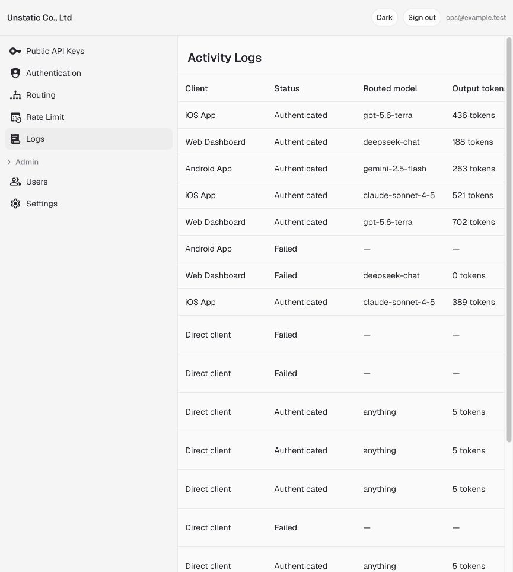

# omni-model

### Ship AI features from client apps without shipping provider secrets

omni-model is a self-hosted LLM proxy for web, mobile, and desktop apps. Your app keeps using the
OpenAI API shape, while omni-model keeps provider keys on infrastructure you control.

Configure authentication, app attestation, rate limits, caching, and model routing from the
dashboard. No custom backend code is required. A single container and PostgreSQL are enough to run
it on a $5-class VPS for a small application, with the same deployment shape when you scale up.

[Get started](#quick-start) · [Read the docs](docs/index.mdx) ·
[Understand the architecture](docs/architecture.mdx)



## Built for client apps

Calling an LLM directly from a browser or app binary exposes the provider key. Building a backend
only to hide that key adds authentication, abuse prevention, metering, routing, and operational work
before you can ship one AI feature.

omni-model gives client developers that backend as a deployable product:

```text
Web, iOS, Android, desktop
        │
        │  OpenAI-compatible request
        │  + publishable key
        │  + user token
        │  + optional app attestation
        ▼
┌──────────────────────────────────────────────┐
│                  omni-model                  │
│                                              │
│  authenticate → attest → limit → cache       │
│                         → route → observe     │
└──────────────────────┬───────────────────────┘
                       │ provider credentials
          ┌────────────┼────────────┬──────────────┐
          ▼            ▼            ▼              ▼
       OpenAI      DeepSeek     Anthropic       Gemini
```

Your provider keys never enter the client. The client only receives a publishable key that identifies
the app, while its existing authentication and attestation tokens identify the user and genuine app
installation.

## What you get

- **Authentication for the providers you already use.** Verify Firebase Auth, Supabase Auth, Clerk,
  Amazon Cognito, or a custom JWT. Each integration uses a dedicated header, so it does not collide
  with OpenAI-compatible client authentication.
- **Application and device attestation.** Require Firebase App Check, Apple App Attest,
  DeviceCheck, Google Play Integrity, Cloudflare Turnstile, or reCAPTCHA Enterprise. Combine
  verifiers to accept multiple client platforms without sharing a secret between them.
- **Flexible model routing with CEL.** Route by model, token count, temperature, user claims, client,
  headers, IP, path, or method. Change the model behind an alias without releasing a new app.
- **Per-user token budgets.** Layer CEL rules for free, paid, internal, or custom user groups. A
  concurrent-request guard prevents parallel calls from racing past a post-paid token budget.
- **Prompt caching.** Identical requests can reuse the same completion. Cache hits avoid an upstream
  call and are marked in activity logs, while size limits and oldest-first eviction keep storage
  bounded.
- **Input protection.** Reject oversized prompts by input-token count before they reach a provider.
  Set the limit in **Settings**.
- **OpenAI-compatible API.** Use `/v1/chat/completions`, streaming SSE, `/v1/models`, and
  `/v1/embeddings` with your preferred OpenAI-compatible SDK.
- **First-class providers.** Route to OpenAI, DeepSeek, Anthropic, Google Gemini, or any
  OpenAI-compatible endpoint.
- **Operational dashboard.** Manage authentication, routing, rate limits, publishable keys, team
  access, cache limits, and organization settings. Inspect request prompts, redacted headers,
  request bodies, routed models, latency, and token usage.
- **One production shape.** One container image, one PostgreSQL database, automatic migrations, live
  configuration reloads, health checks, and graceful shutdown.

## Quick start

### Local

Clone the repository, generate two local secrets, and start the dashboard with PostgreSQL:

```sh
docker build -t omni-model:local .

printf 'OMNI_ADMIN_SECRET=%s\nOMNI_ENCRYPTION_KEY=%s\n' \
  "$(openssl rand -base64 32)" \
  "$(openssl rand -base64 32)" > examples/.env

docker compose \
  --env-file examples/.env \
  -f examples/docker-compose.dashboard.yml \
  up -d --wait
```

Open [http://localhost:8787/admin](http://localhost:8787/admin), create the first operator, then:

1. Choose your user authentication and optional app-attestation methods.
2. Add a model-routing rule and provider key.
3. Set token budgets and input limits.
4. Generate a publishable key for your app.

The dashboard validates and applies changes immediately. You do not need to restart the proxy.

### Docker

If PostgreSQL already exists, run the published image directly:

```sh
docker run -d --name omni-model \
  -p 8787:8787 \
  -e OMNI_STORAGE_TYPE=postgres \
  -e OMNI_STORAGE_POSTGRES_URL='postgres://omni:password@db:5432/omni' \
  -e OMNI_ADMIN_SECRET='replace-with-at-least-32-characters' \
  -e OMNI_ENCRYPTION_KEY='replace-with-32-random-bytes-base64' \
  ghcr.io/tiepvuvan/omni-model:latest
```

Open `/admin` and finish configuration in the dashboard. The container starts safely even before
configuration: `/healthz` stays available while `/v1/*` remains closed.

See the [Docker guide](docs/installation/docker.mdx) for upgrades, health checks, migrations, and
backups.

### Production with a custom domain

The repository includes a production-shaped Docker Compose stack with PostgreSQL and Caddy:

```sh
cp examples/custom-domain.env.example examples/.env
```

Set your domain and generate the stable secrets described in `examples/.env`, then run:

```sh
docker compose \
  --env-file examples/.env \
  -f examples/docker-compose.custom-domain.yml \
  up -d --wait
```

Caddy obtains and renews HTTPS certificates. PostgreSQL and Caddy use named volumes, both services
have health checks, and omni-model stays private behind the reverse proxy.

Choose a deployment guide:

- [Google Cloud Run](docs/deployments/cloud-run.mdx)
- [Fly.io](docs/deployments/fly-io.mdx)
- [Hetzner or another VPS](docs/deployments/vps.mdx)
- [Coolify](docs/deployments/coolify.mdx)

## Integrate from your app

Use the SDK you already prefer. Set its base URL to omni-model, use an omni-model publishable key as
the SDK API key, and add the headers required by your authentication configuration.

```ts
import OpenAI from "openai";

const llm = new OpenAI({
  baseURL: "https://ai.example.com/v1",
  apiKey: publishableKey,
  defaultHeaders: {
    "X-Firebase-ID-Token": await currentUser.getIdToken(),
    "X-Firebase-AppCheck": (await getToken(appCheck)).token,
  },
  dangerouslyAllowBrowser: true,
});

const response = await llm.chat.completions.create({
  model: "smart",
  messages: [{ role: "user", content: "Explain this screen." }],
});
```

The `Authorization` header carries the publishable key for OpenAI SDK compatibility. User identity
and app proofs use dedicated headers:

| Purpose | Header examples |
| --- | --- |
| Client application | `Authorization: Bearer <publishable-key>` |
| Signed-in user | `X-Firebase-ID-Token`, `X-Supabase-Access-Token`, `X-Clerk-Session-Token`, `X-Cognito-ID-Token` |
| Genuine application | `X-Firebase-AppCheck`, `X-Apple-Device-Token`, App Attest headers |

Client guides:

- [JavaScript, browsers, and LangChain-compatible clients](docs/integrations/javascript.mdx)
- [Swift and MacPaw/OpenAI](docs/integrations/swift.mdx)
- [Apple Foundation Models](docs/integrations/foundation-models.mdx)
- [Kotlin](docs/integrations/kotlin.mdx)
- [React Native](docs/integrations/react-native.mdx)
- [Flutter](docs/integrations/flutter.mdx)

## Design principles

- **Closed by default.** The proxy cannot serve `/v1/*` until a user verifier is configured.
- **Credentials stay credentials.** Provider keys are encrypted before storage and never returned
  by the admin API.
- **Configuration changes are safe.** A new revision is validated before it is stored and applied.
  A bad edit leaves the last working revision serving.
- **Requests keep one consistent configuration.** Live reloads never change the policy of a request
  or stream already in flight.
- **Observability must not become an outage.** Request logging is bounded and fail-open. Content
  capture is optional, capped, and redacts credential-bearing headers.

Read more:

- [Architecture](docs/architecture.mdx)
- [Storage and backups](docs/storage.mdx)
- [Model routing](docs/model-routing/routing.mdx)
- [Application verification](docs/security/verify-on-device.mdx)
- [Request logs](docs/reference/logging.mdx)
- [Configuration reference](docs/reference/configuration.mdx)

## License

omni-model is licensed under the [Apache License 2.0](LICENSE). It is free to use, modify, and
self-host for personal or commercial applications under the license terms.
